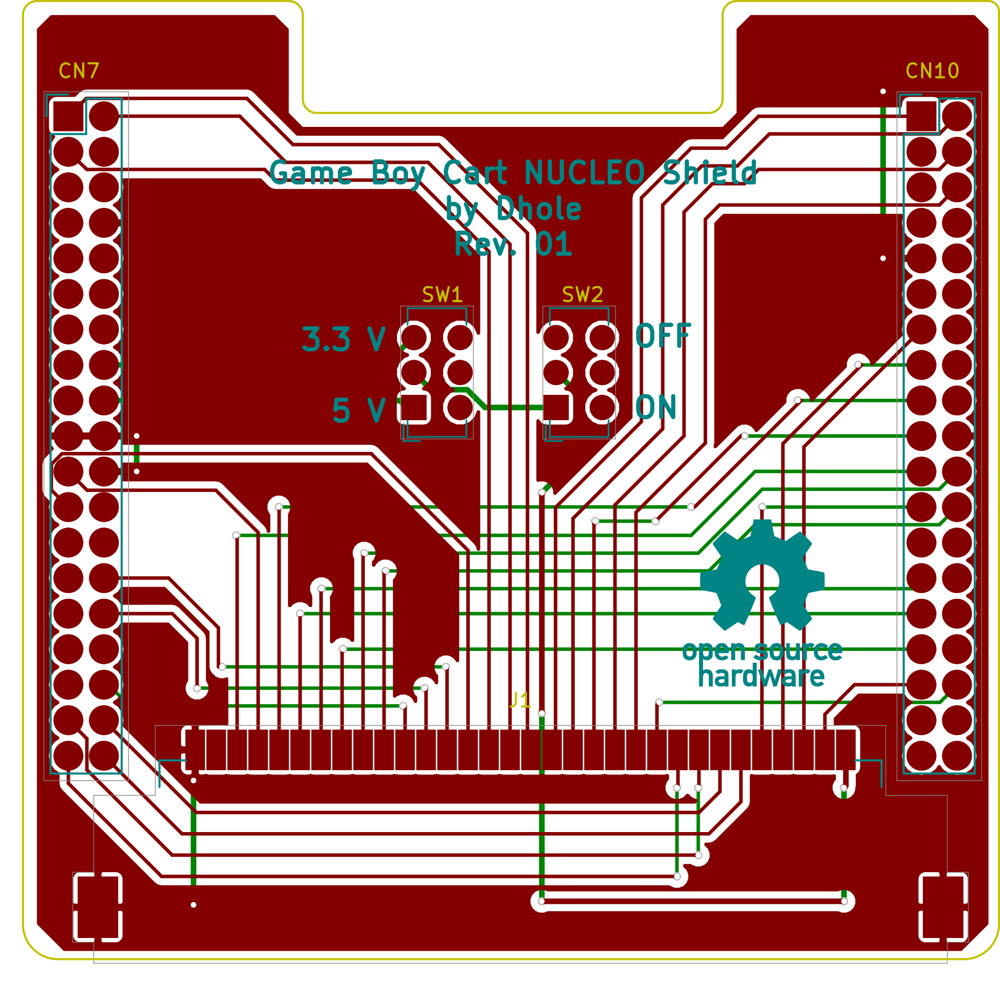
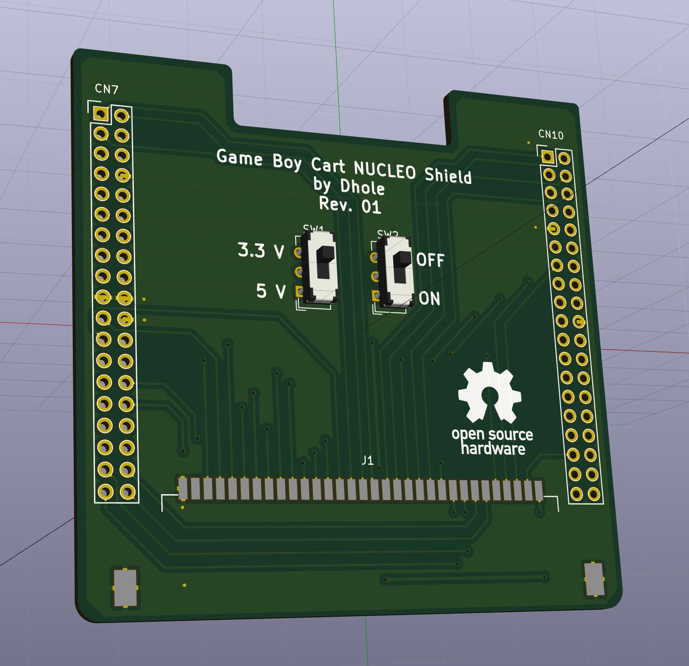

# Game Boy Cart NUCLEO Shield

## Description

This is the design of a Shield for NUCLEO STM32 development boards (also known
as STM32 NUCLEO Morpho) to connect Game Boy cartridges.

This PCB is meant to be used with my Game Boy Cart reader/writer:

- [gb-rw-stm32f411](https://github.com/Dhole/gb-rw-stm32f411)
- [gb-rw-host](https://github.com/Dhole/gb-rw-host)

## Pictures

## License

To design this PCB is based on an [STM32 NUCLEO Morpho template made by
mobilinkd](https://github.com/mobilinkd/stm-morpho-template) published under
the MIT License.

I'm publishing the rest of the work under the [Creative Commons Attribution-ShareAlike license](https://creativecommons.org/licenses/by-sa/4.0/).

**CC BY-SA**
